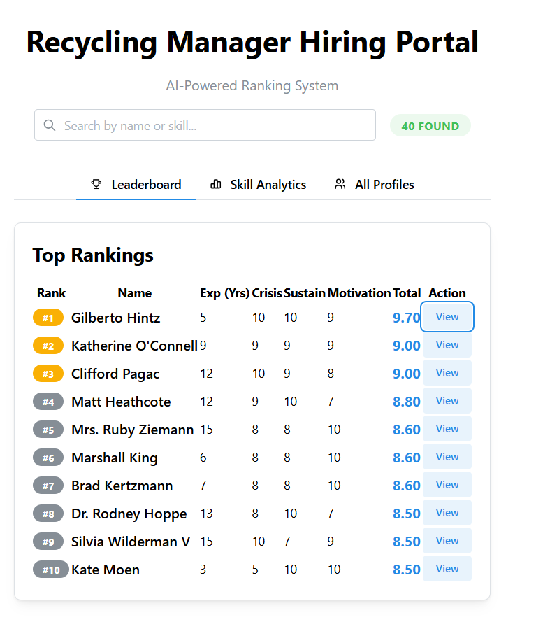
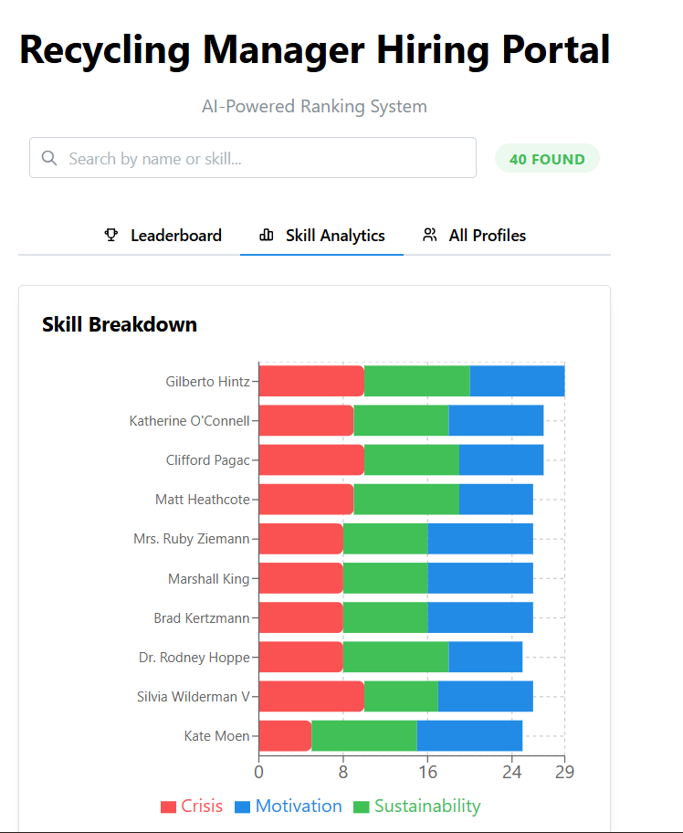
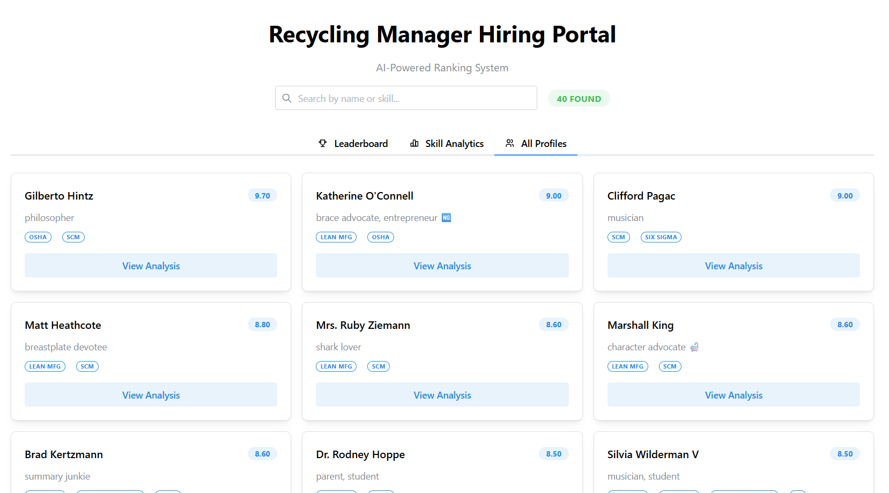

# Recycling Production Manager Ranking System

A minimal, full-stack conceptual system to rank candidates using AI evaluations and a React Dashboard.

## 🚀 Features
- **MySQL Schema:** Normalized tables + Weighted Ranking View.
- **Data Generator:** Node.js script using Faker.js to create 40 realistic profiles.
- **AI Scoring:** Logic to rank based on Crisis Management, Sustainability, and Motivation.
- **Dashboard:** Interactive React + Mantine UI with Leaderboards and Skill Heatmaps.

## 📸 Screenshots
**All Profiles view:** Browse candidate cards with quick scores and skills.



**Leaderboard view:** Ranked table with category scores and total.



**Skill Analytics view:** Stacked skill breakdown across top candidates.



## 🛠 Setup

### 1. Data Generation
Navigate to the backend folder and generate the mock data:
```bash
cd backend
npm install
node seeder.js
# This creates mockData.json in the frontend folder